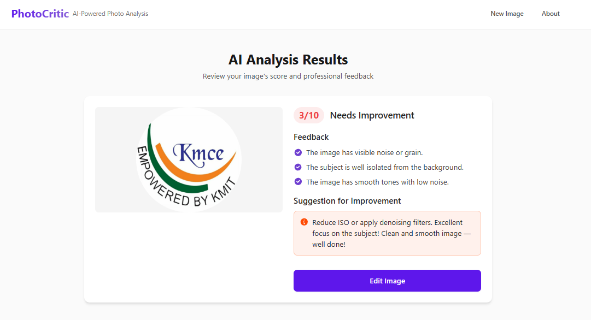
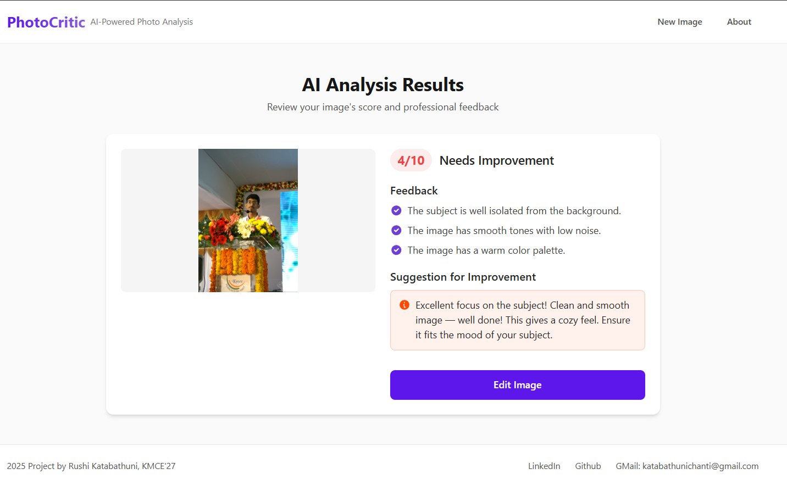
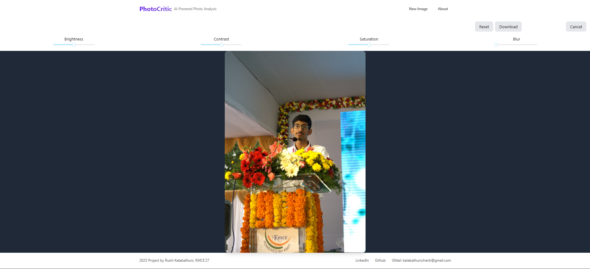

# 🎨 AI Art Critic & Feedback System

This is a full-stack web application that allows users to upload artwork, receive AI-generated aesthetic analysis and feedback, and optionally edit the image using controls like brightness, contrast, and saturation.

## ✨ Features

- Upload any artwork (JPG/PNG)
- AI analyzes and gives:
  - Aesthetic score (1–10)
  - Detailed textual feedback
  - Improvement suggestions
- Image editing options: brightness, contrast, saturation
- Built using **ReactJS (Vite + Tailwind)** for frontend and **FastAPI** for backend
- Aesthetic and feedback models based on `aesthetic-predictor-v2-5` and `CLIP`

## 🧠 How It Works (Behind the Scenes)

### 1. Aesthetic Scoring (`aesthetic_score.py`)

- Loads a pretrained **aesthetic-predictor-v2-5** model dynamically using PyTorch.
- Preprocesses user-uploaded images.
- Outputs a continuous aesthetic score between 1 and 10 indicating the artwork’s quality.
- Utilizes GPU acceleration if available, else CPU fallback.

### 2. Detailed Image Analysis (`clip_analysis.py`)

- Uses a local TorchScript version of **OpenAI's CLIP** (ViT-B-32).
- Defines a set of human-readable feedback concepts (e.g., saturation, contrast, lighting).
- Encodes both image and text prompts, computing similarity scores.
- Picks top 3 matching feedback statements and compiles actionable improvement suggestions.
- Outputs JSON with feedback and suggestions for the frontend to display.

### 3. Image Editing

- Frontend provides sliders for brightness, contrast, and saturation.
- Adjustments are applied live on the client side for immediate user feedback.


## 🚀 Getting Started

### 🔧 Backend Setup (FastAPI)

1. Create virtual environment:
```bash
cd backend
python -m venv venv
source venv/bin/activate  # On Windows: venv\Scripts\activate
```

2. Install dependencies:
```bash
pip install fastapi uvicorn pillow torch torchvision transformers
```

4. Run the server:
```bash
uvicorn main:app --reload
```

API should be live at `http://localhost:xxxx`

### 💻 Frontend Setup (React)

1. Open a new terminal:
```bash
cd frontend
npm install
npm run dev
```

Frontend runs at `http://localhost:xxxx`


## 🛠️ Technologies Used

- Frontend: ReactJS, Vite, TailwindCSS
- Backend: FastAPI, PyTorch
- Models: aesthetic-predictor-v2-5, OpenAI CLIP

## 📸 Sample







Inspired by open-source work in AI aesthetics and image understanding.


